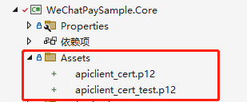
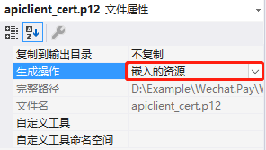

# WeChat

适用于AbpBoilerplate的微信模块。

### WeChat.Common
* 公共库

### WeChat.Pay
* 普通商户模式微信支付
* 服务商模式微信支付
* 境内服务商分账

### WeChat.MiniProgram

* 小程序码服务
* 小程序登录服务
* 手机号获取服务
* 小程序订阅消息服务
* 小程序数据分析服务

### WeChat.Official

* 公众号自定义菜单服务
* 公众号素材管理相关服务接口定义
* 公众号模板消息服务
* 公众号用户管理服务
* 公众号用户标签管理服务

## 更新

Date | Version | Content
:----------: | :-----------: | :-----------
V0.1.0     | 2023-4-22        | 初始版本
V0.1.1     | 2023-5-19        | 添加 小程序数据分析WeAnalysis 获取访问页面数据接口


## 快速开始

其他使用案例请参考sample/WeChatPaySample

<b>注意！Sample中的证书文件和配置为模拟数据，运行前请替换成真实有效的证书和配置</b>


### 添加Abp模块依赖

在项目中引用[AbpBoilerplate.WeChat.Pay]( https://www.nuget.org/packages/AbpBoilerplate.WeChat.Pay)、[AbpBoilerplate.WeChat.MiniProgram]( https://www.nuget.org/packages/AbpBoilerplate.WeChat.MiniProgram)或[AbpBoilerplate.WeChat.Official]( https://www.nuget.org/packages/AbpBoilerplate.WeChat.Official)


```
dotnet add package AbpBoilerplate.WeChat.Pay
dotnet add package AbpBoilerplate.WeChat.MiniProgram
dotnet add package AbpBoilerplate.WeChat.Official
```

添加WeChatModule模块依赖
```
[DependsOn(typeof(PayModule))]
[DependsOn(typeof(MiniProgramModule))]
[DependsOn(typeof(OfficialModule))]
public class YourCoreModule : AbpModule

```

### 配置服务

appsettings.json配置文件中，添加服务相关配置

示例：
```
"WeChat": {
    "MiniProgram": {
        "AppId": "wx0123456789123456",                      //小程序AppId
        "AppSecret": "cae470e3235798",                      //小程序AppSecret
    },
    "Official": {
        "AppId": "wx0123456789123456",                      //小程序AppId  
        "AppSecret": "cae470e3235798",                      //小程序AppSecret
  
    },
    "Pay": {
        "ApiKey": "TESTcom12345678TESTcom12345678",         //商户平台API密钥
        "MchId": "1234567890",                              //商户号
        "IsSandBox": "false",                               //是否处于沙箱模式。当处于沙箱模式时，所有的支付服务将会调用沙箱支付接口，该参数值默认为 false。
        "NotifyUrl": "https://yourwebsite/api/WeChat/PayNotify",  //支付结果的回调地址，用于接收支付结果通知。
        "RefundNotifyUrl": "https://yourwebsite/api/WeChat/RefundNotify", //退款结果的回调地址，用于接收退款结果通知
        "CertificateBlobContainerName": "Cert",             //证书存储容器名称
        "CertificateBlobName": "apiclient_cert_test",       //证书存储文件名称
        "CertificateAssetsName": "WeChatPaySample.Core.Assets.apiclient_cert_test.p12",       //证书资源名
        "CertificateFilePath": "D:\\apiclient_cert_test.p12",//证书文件物理路径
        "CertificateSecret": "1234567890"                   //PKCS 12 证书的密钥，默认为商户号
    }
}
...

```
### 配置证书

默认提供两种证书存储方式，
1. 存储在FileStorage文件系统（推荐）；
2. 存储在本地文件系统。


#### FileStorage文件系统
需要配置

```
"CertificateBlobContainerName": "Cert",             //证书存储容器名称
"CertificateBlobName": "apiclient_cert_test",       //证书存储文件名称
"CertificateAssetsName": "WeChatPaySample.Core.Assets.apiclient_cert_test.p12",       //证书资源名
```
将有效的证书文件放在CertificateAssetsName对应的文件目录下，并设置属性为`嵌入的资源`。






#### 本地文件系统
需要配置
```
"CertificateFilePath": "D:\\apiclient_cert_test.p12"   //证书文件物理路径
```

保证路径下存在有效的证书文件。


## 使用帮助

在类中注入相关服务即可

调用小程序登录示例
```
using WeChat.MiniProgram.Services.Login;
```

```
public class MiniProgramAppService : ApplicationService
{
    private readonly LoginService loginService;

    public MiniProgramAppService(LoginService loginService)
    {          
        this.loginService = loginService;
    }
    public async Task<Code2SessionResponse> Login(string accessCode)
    {

        var weChatLoginResult = await loginService.Code2SessionAsync(accessCode);
        if (weChatLoginResult.ErrorCode != 0)
        {
            LogHelper.Logger.Error("小程序调用获取token接口失败，原因" + weChatLoginResult.ErrorMessage);
        }
        return weChatLoginResult;
    }   
}
```

## 可扩展性

你可以自己写一个CertificateStorageProvider获取证书文件，只需要实现ICertificateStorageProvider接口,并在你的CoreModule中注册CertificateStorageProviderType为自己的实现类即可。

```

public class MyCertificateStorageProvider : ICertificateStorageProvider
{


    public byte[] GetBytes()
    {
        var url = "http://api.xxxx.com/get-certificate";
        byte[] fileBytes = default(byte[]);
        using (var webClient = new WebClient())
        {
            webClient.Headers.Add("Authorization", "xxxx");
            var formData = new NameValueCollection();
            formData["file_id"] = "xxxxx";
            fileBytes = webClient.UploadValues(url, "POST", formData);
        }
        return fileBytes;
    }
    ...
}

```

```
IocManager.Register<ICertificateStorageProvider, MyCertificateStorageProvider>();
```


## 感谢

https://github.com/EasyAbp/Abp.WeChat

## 作者信息

作者：林小

邮箱：jevonsflash@qq.com


## License

The MIT License (MIT)
